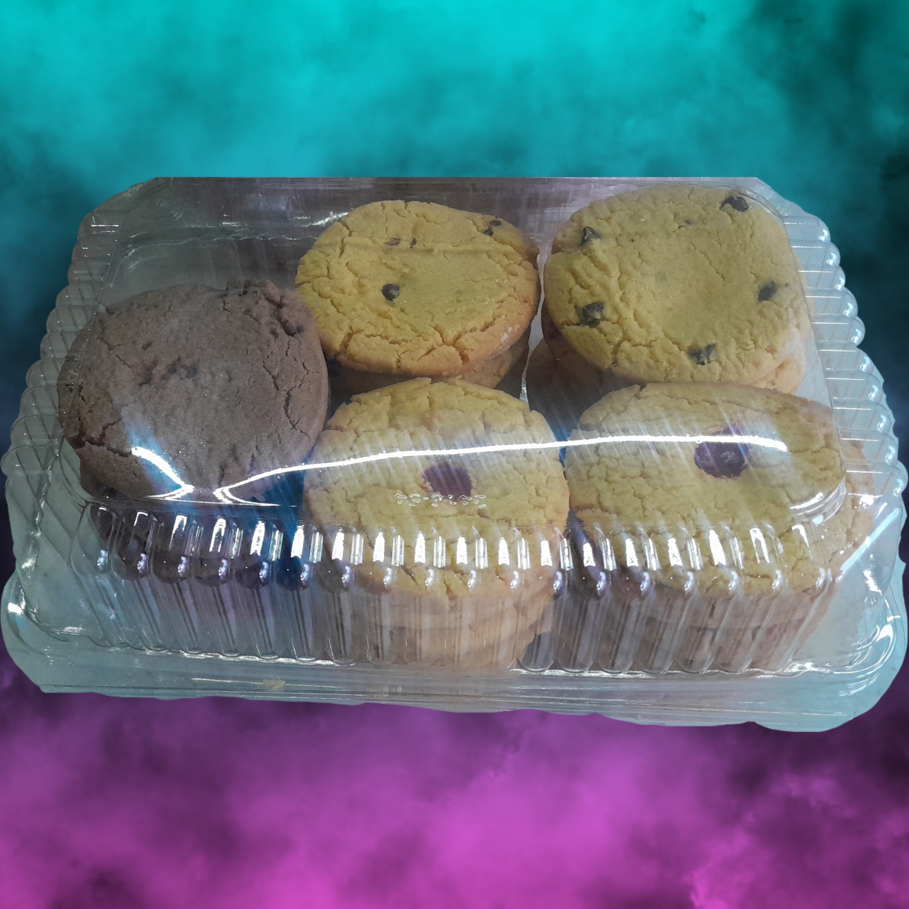
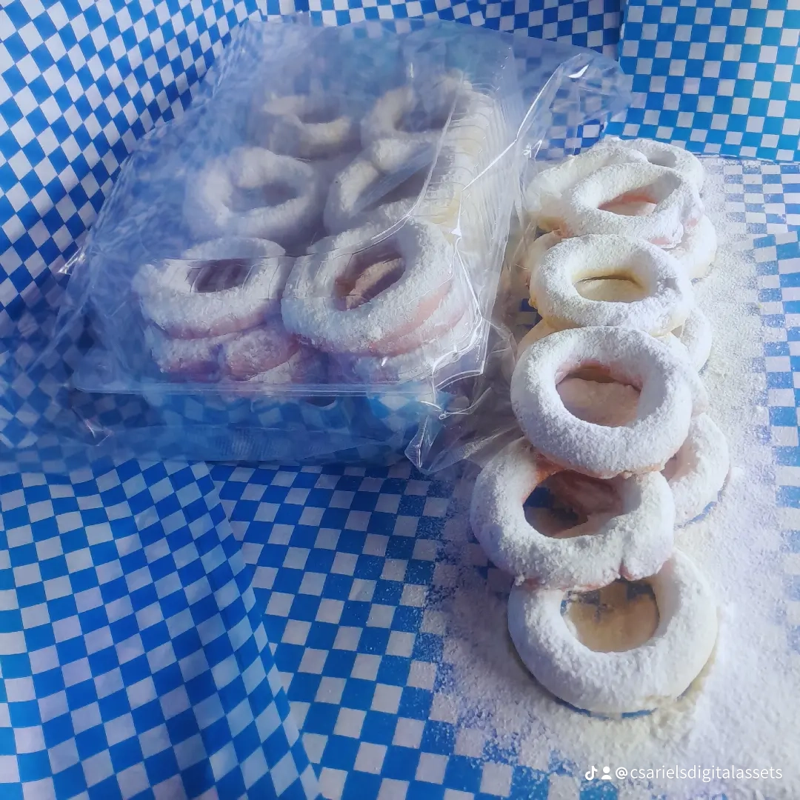

# Csariel-s-Digital-Assets-
​Scaling a traditional Mexican bakery through Web3, NFTs, and industrial automation.

Nivel Nombre Beneficio para el Extranjero
BRONCE Founding Baker Acceso al canal exclusivo de Discord y agradecimiento en la web.
PLATA Master Crafter Receta digital exclusiva + Voto en el siguiente sabor de la planta.
ORO Legacy Partner Tu nombre grabado en la maquinaria industrial + NFT 1/1 único.
0x45c6455aa01356609d96b659c6eb880b7e1d046d

​[ **Haz clic aquí para ver el video del proyecto**](https://github.com/csarielscontacto-commits/Csariel-s-Digital-Assets-/blob/main/watermark-2026-04-26-004512348.mp4)

### 🎥 Presentación del Proyecto
[**▶️ Haz clic aquí para ver el video del avance industrial**](https://github.com/csarielscontacto-commits/Csariel-s-Digital-Assets-/blob/main/watermark-2026-04-26-004512348.mp4)

---

### 🍪 Galería de Productos e Infraestructura

Aquí puedes ver el corazón de nuestra producción:

| Calidad y Sabor | Proceso de Horneado |
| :---: | :---: |
|  |  |

# 🍪 Sariel's: Activos Digitales e Innovación Industrial

Bienvenidos al ecosistema digital de **Sariel's**. Aquí gestionamos la identidad visual y tecnológica de nuestra expansión industrial.

---

### 🖼️ Portafolio Visual (Vista Previa)

| Identidad de Marca | Producto Terminado |
| :---: | :---: |
|  |  |

---

### 🏭 Avances de Infraestructura

| Proceso en Horno | Demo de Operación |
| :---: | :---: |
|  | [🎥 Ver Clip de TikTok](https://github.com/csarielscontacto-commits/Csariel-s-Digital-Assets-/blob/main/2acc4ffd5ef14238fffb4da2dce66edc.mp4) |

---

### 🚀 Próximamente: Video de Proceso Industrial
*Mañana subiremos el video detallado de la elaboración, el uso del horno de 6 charolas y la automatización en tiempo real.*

> **Nota:** Este repositorio es de carácter público para la verificación de activos digitales y transparencia del proyecto Web3.

*Nuestras galletas Sevillanos combinan la receta tradicional con la eficiencia de la automatización industrial.*
